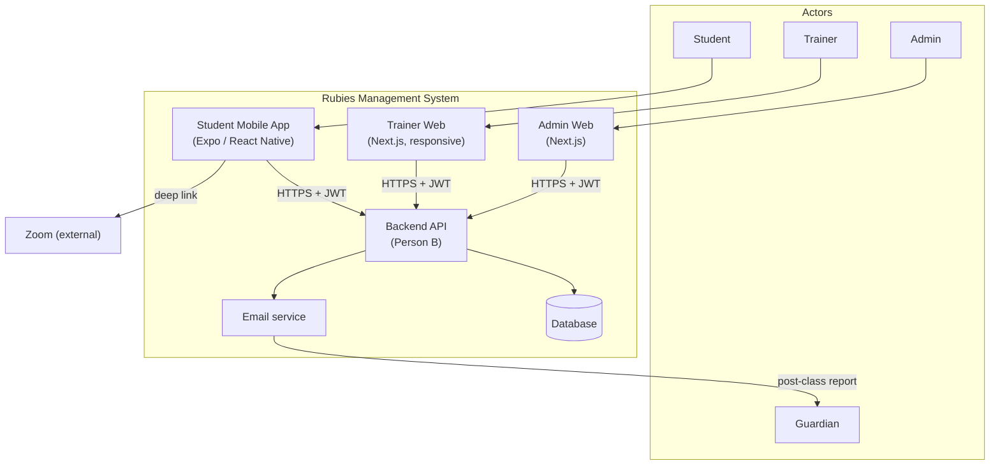
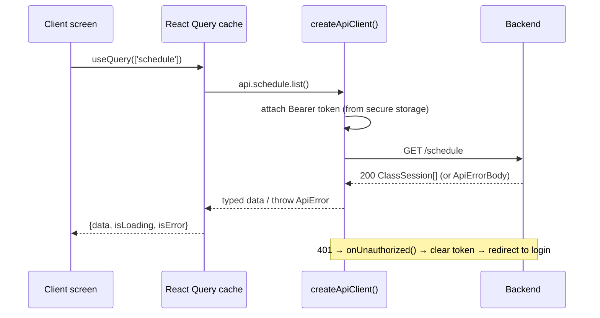
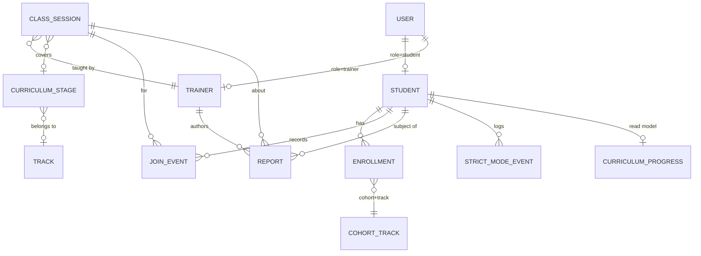
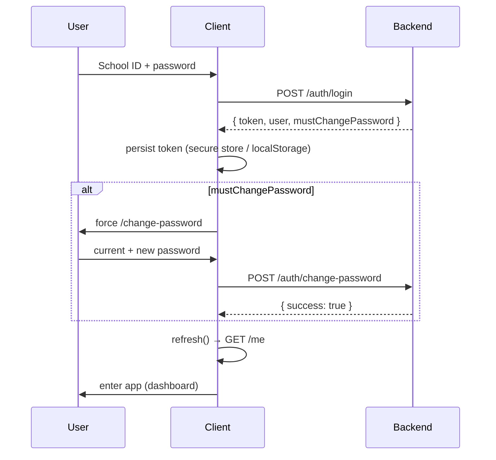
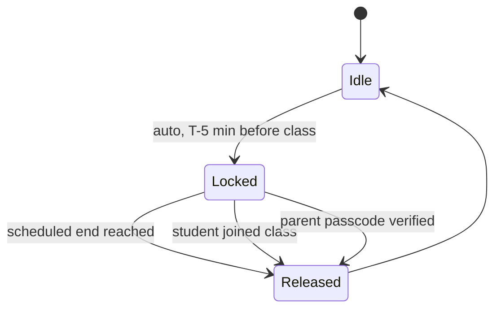
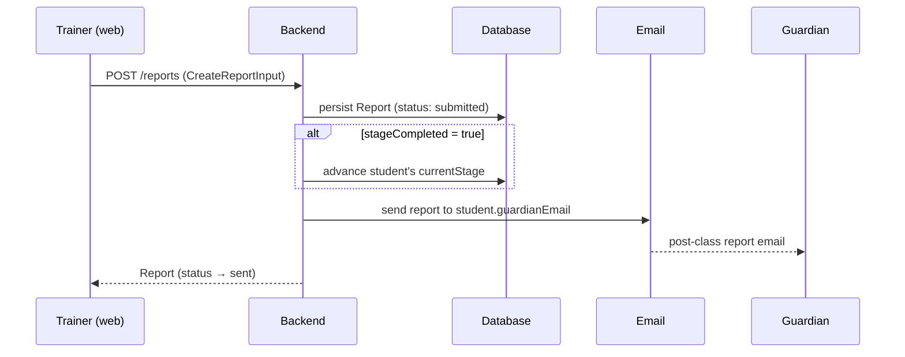

# System Design Document — Rubies Code School Management System

**Status:** Draft for the 2-week competition build
**Last updated:** 2026-09-15
**Target ship date:** ~2026-09-23
**Authors / owners:** Person A (Student mobile + Trainer web), Person B (Backend, DB, APIs, email, Admin web)

---

## Table of contents

1. [Introduction](#1-introduction)
2. [Goals & non-goals](#2-goals--non-goals)
3. [System context](#3-system-context)
4. [Architecture overview](#4-architecture-overview)
5. [Technology stack](#5-technology-stack)
6. [Repository & module structure](#6-repository--module-structure)
7. [The shared contract package](#7-the-shared-contract-package)
8. [Data model](#8-data-model)
9. [API design](#9-api-design)
10. [Authentication & authorization](#10-authentication--authorization)
11. [Feature designs & key flows](#11-feature-designs--key-flows)
12. [Client application designs](#12-client-application-designs)
13. [Backend design (Person B)](#13-backend-design-person-b)
14. [Design system](#14-design-system)
15. [Non-functional requirements](#15-non-functional-requirements)
16. [Security considerations](#16-security-considerations)
17. [Deployment & environments](#17-deployment--environments)
18. [Ownership & responsibilities](#18-ownership--responsibilities)
19. [Risks & mitigations](#19-risks--mitigations)
20. [Open questions & assumptions](#20-open-questions--assumptions)
21. [Milestones & timeline](#21-milestones--timeline)
22. [Appendix A — endpoint ↔ surface matrix](#appendix-a--endpoint--surface-matrix)

---

## 1. Introduction

### 1.1 Purpose

This document describes the end-to-end design of the **Rubies Code School Management System** — the architecture, data model, API contract, authentication, feature flows, and the split of work between the two builders. It is the shared reference both collaborators code against and the narrative a reviewer can read to understand the whole system.

### 1.2 Problem statement

Rubies Code School currently coordinates classes, attendance, curriculum progress, and parent communication through manual spreadsheets and ad-hoc email. This is error-prone and gives students, trainers, and guardians no single, trustworthy view. The system replaces that workflow with:

- **Students** (mobile): see their schedule, join classes, track curriculum progress, and stay focused during class via **Strict Mode**.
- **Trainers** (web): see assigned students, track curriculum, and file structured **post-class reports** that are emailed to guardians automatically.
- **Admins** (web): manage users, enrollments, classes, and password resets.

### 1.3 Scope

This is a **2-week competition build**. The design deliberately favors a small, correct, shippable core over feature completeness. See [§2](#2-goals--non-goals) for the explicit guardrails.

### 1.4 Glossary

| Term            | Meaning                                                                                                                     |
| --------------- | --------------------------------------------------------------------------------------------------------------------------- |
| **School ID**   | Human-readable identity of the form `RCS-[ROLE]-[YEAR]-[IDENTIFIER]`, e.g. `RCS-STU-2025-884`. Used as the login username.  |
| **Strict Mode** | An **app-based** focus lock that keeps a student on the live class. In-app full-screen overlay — _not_ an OS/kiosk lock.    |
| **Contract**    | `packages/shared/src/types.ts` + `api.ts` — the typed source of truth for everything exchanged between clients and backend. |
| **Surface**     | A distinct client experience: Student mobile, Trainer web, Admin web.                                                       |
| **Guardian**    | Parent/guardian who receives post-class reports and can hold the Strict Mode passcode.                                      |
| **Join event**  | Attendance signal recorded when a student taps "Join on Zoom".                                                              |

---

## 2. Goals & non-goals

### 2.1 Goals

- One coherent system across three surfaces with a **single typed API contract**.
- A student can log in, see the next class, join it, and track progress.
- A trainer can log in, see their students, and submit a post-class report that reaches the guardian.
- Strict Mode demonstrably keeps a student on-task during class hours.
- Ship in ~2 weeks with a clean, reviewable codebase.

### 2.2 Non-goals (explicitly cut for this build)

These were **locked decisions** to protect the timeline:

- ❌ **SSO** / third-party identity providers.
- ❌ **Self-service forgot-password / reset.** Resets are **admin-driven**.
- ❌ **OS-level / kiosk Strict Mode.** Strict Mode is an **in-app overlay only**.
- ❌ **Push-notification infrastructure.** Class reminders are **local device notifications**; Strict-Mode release is **scheduled-time based** (no server push, no manual "End Class").
- ❌ **Student on web** and **Trainer on native mobile.** Student = mobile only; Trainer = responsive web only.
- ❌ Design flourishes from the Stitch mocks that add complexity without core value (role-switcher tabs, telemetry dashboards, floaty decorative surfaces).

### 2.3 Design principles

1. **Contract-first.** Types drive both sides; UI and backend evolve against the same file.
2. **Ship the spine, not the skeleton of everything.** Each surface does its few jobs well.
3. **Boring, current, documented tech.** Use the exact installed framework versions and their real docs (both apps ship framework-specific `AGENTS.md` rules requiring this).
4. **Structural clarity over decoration** (see [§14](#14-design-system)).

---

## 3. System context



**Primary interactions:**

- All three clients talk to **one backend API** over HTTPS using a **JWT bearer token**.
- The mobile app opens **Zoom** via deep link for class join.
- The backend sends **guardian emails** when a report is submitted.

---

## 4. Architecture overview

### 4.1 Shape

A single **npm-workspaces monorepo** holding three deployable/runnable units plus one shared library:

```
rubies-management-system/
├── packages/shared/     @rubies/shared — API contract (types) + design tokens + typed fetch client
├── apps/mobile/         Student app     — Expo SDK 57, expo-router, React 19
└── apps/web/            Trainer + Admin — Next.js 16, Tailwind v4, React 19
```

### 4.2 Why a monorepo

- **One contract, zero drift.** `@rubies/shared` is imported by both apps as **raw TypeScript** (no build step): Metro `watchFolders` for mobile, `transpilePackages` for Next.js. A change to the contract instantly re-type-checks every consumer.
- **Two builders, one source of truth.** Person A and Person B edit the same repo; the shared package is the coordination point.
- **Shared design tokens.** Colors/spacing/type live once and are consumed on both native and web.

### 4.3 Data-flow (typical request)



- **Server state** is owned by **@tanstack/react-query** (retry 1, `staleTime` 30s, no refetch-on-focus).
- **Auth/session state** is owned by a small **AuthProvider** context per app.
- **Transport** is a single typed `createApiClient()` from the shared package, instantiated once per app with app-specific token storage.

---

## 5. Technology stack

| Concern              | Choice                  | Version (installed)                    | Notes                                                                                 |
| -------------------- | ----------------------- | -------------------------------------- | ------------------------------------------------------------------------------------- |
| Language             | TypeScript              | ~6.0 (mobile), ^5.6 (shared), ^5 (web) | `strict`, `noUncheckedIndexedAccess`.                                                 |
| Monorepo             | npm workspaces          | npm 11.6 / Node ≥20 (dev on 24)        | `packages/*`, `apps/*`.                                                               |
| Mobile runtime       | Expo SDK / React Native | 57 / 0.86.3                            | New architecture, React Compiler on.                                                  |
| Mobile routing       | expo-router             | ~57.0.20                               | File-based, typed routes.                                                             |
| Mobile storage       | expo-secure-store       | ~57.0.3                                | Encrypted token storage.                                                              |
| Mobile notifications | expo-notifications      | ~57.0.17                               | Local `DATE`-trigger reminders.                                                       |
| Web framework        | Next.js (App Router)    | 16.3.4                                 | React 19.2.8; async `params`/`searchParams`; `LayoutProps`/`PageProps` typed helpers. |
| Web styling          | Tailwind CSS            | v4                                     | CSS-first (`@import "tailwindcss"`, `@theme`), no `tailwind.config.js`.               |
| Server state         | @tanstack/react-query   | ^5.62                                  | Both apps.                                                                            |
| React                | React / React DOM       | 19.2.x                                 | Both apps.                                                                            |

> **Version discipline:** `apps/mobile/AGENTS.md` and `apps/web/AGENTS.md` require reading the _installed_ versioned docs before writing code (Expo v57 docs; Next.js docs bundled under `node_modules/next/dist/docs/`). Both frameworks have breaking changes vs. older mental models.

---

## 6. Repository & module structure

```
rubies-management-system/
├── package.json                 # workspaces + root scripts (mobile/web/typecheck/lint)
├── tsconfig.base.json           # shared compiler options + @rubies/shared path aliases
├── README.md · STATUS.md · SYSTEM_DESIGN.md
│
├── packages/shared/
│   └── src/
│       ├── types.ts             # ← THE API CONTRACT (entities, DTOs, error envelope)
│       ├── api.ts               # createApiClient() + ApiError
│       ├── tokens.ts            # design tokens (colors, spacing, radius, type, roleBadge)
│       └── index.ts             # barrel export
│
├── apps/mobile/                 # STUDENT (Expo)
│   ├── app.json · metro.config.js
│   └── src/
│       ├── app/                 # expo-router routes
│       │   ├── _layout.tsx           # providers + Stack
│       │   ├── index.tsx             # auth-gated redirect
│       │   ├── (auth)/login.tsx
│       │   ├── (auth)/change-password.tsx
│       │   ├── (tabs)/_layout.tsx    # tab bar
│       │   ├── (tabs)/dashboard.tsx
│       │   ├── (tabs)/schedule.tsx
│       │   ├── (tabs)/curriculum.tsx
│       │   ├── (tabs)/profile.tsx
│       │   ├── class/[id].tsx        # class detail + Join
│       │   └── strict-mode.tsx       # explainer + passcode + lock overlay
│       ├── components/ui/       # Screen, Button, Card
│       └── lib/                 # config, theme, storage, api, auth, notifications, format
│
└── apps/web/                    # TRAINER (Person A) + ADMIN (Person B)
    ├── next.config.ts           # transpilePackages: ['@rubies/shared']
    └── app/
        ├── layout.tsx · globals.css
        ├── (trainer)/ …         # login, dashboard, students, curriculum, report  → Person A
        └── (admin)/ …           # admin console                                    → Person B
```

Root scripts:

```bash
npm run mobile      # expo start (workspace: mobile)
npm run web         # next dev  (workspace: web)
npm run typecheck   # tsc --noEmit across all workspaces (--if-present)
npm run lint        # lint across all workspaces (--if-present)
```

---

## 7. The shared contract package

`@rubies/shared` is the hinge of the whole system. It is **framework-agnostic** (uses only global `fetch`) so it runs unchanged in React Native, Next.js, and Node.

It exports three things:

1. **`types.ts` — the contract.** Every entity, DTO, enum, and the error envelope. Both clients and backend build against these shapes. Conventions: timestamps are ISO-8601 UTC strings; ids are opaque strings; JSON everywhere.
2. **`api.ts` — the typed client.** `createApiClient({ baseUrl, getToken, onUnauthorized })` returns a namespaced client (`auth`, `me`, `schedule`, `curriculum`, `students`, `reports`, `events`, `strictMode`). It:
   - attaches `Authorization: Bearer <token>` when a token is available,
   - serializes/deserializes JSON,
   - throws a typed **`ApiError`** (carrying `status`, `code`, `details`) on non-2xx,
   - invokes `onUnauthorized()` on any `401` (used to force logout).
3. **`tokens.ts` — design tokens.** Colors, spacing, radius, font families/sizes/weights, and `roleBadge` styles. Consumed as JS objects on native and mirrored into Tailwind `@theme` on web.

**Consumption model:** raw `.ts`, no compile step. `tsconfig.base.json` maps `@rubies/shared` → `packages/shared/src/index.ts`; Metro watches the monorepo root; Next transpiles the package.

---

## 8. Data model

### 8.1 Entity–relationship overview



### 8.2 Core entities (from `types.ts`)

- **`User`** — `id`, `schoolId`, `role` (`student|trainer|admin`), `firstName`, `lastName`, `email|null`, `mustChangePassword`, `createdAt`.
- **`Student extends User`** — `cohort`, `track`, `guardianName|null`, **`guardianEmail`** (reports auto-sent here), `currentStageId|null`, `strictModePasscodeSet`.
- **`Trainer extends User`** — `title|null`.
- **`ClassSession`** — `id`, `title`, `description|null`, `trainerId`, `trainerName`, `cohort`, `track|null`, `curriculumStageId|null`, `scheduledStartAt`, `scheduledEndAt`, `status` (`scheduled|live|ended|cancelled`), **`zoomJoinUrl`**, `zoomMeetingId|null`.
- **`Enrollment`** — links a student to a `cohort`/`track` (basis for their schedule).
- **`CurriculumStage`** — `id`, `order` (1-based), `title`, `description|null`, `track|null`.
- **`CurriculumProgress`** (read model) — `studentId`, `currentStageId|null`, `currentStageOrder`, `totalStages`, `completedStageIds[]`, **`percentComplete`** (0–100, backend-computed), `stages[]`.
- **`Report`** — `id`, `classId`, `studentId`, `trainerId`, `status` (`draft|submitted|sent`), `attendance` (`present|late|absent`), `participation` (1–5), `curriculumStageId`, **`stageCompleted`** (true → backend auto-advances student), `topicsCovered`, `strengths`, `areasToImprove`, `homework|null`, `trainerComments`, `submittedAt|null`, `createdAt`.
- **`JoinEvent`** — attendance signal: `studentId`, `classId`, `joinedAt`, `source: 'zoom_deeplink'`.
- **`StrictModeEvent`** — `type` (`activated|released`), `reason` (`scheduled_end|class_joined|passcode_override`), `source` (`auto|parent`), `at`.

### 8.3 Notable modeling decisions

- **`CurriculumProgress` is a precomputed read model.** The backend computes `percentComplete` and `currentStageOrder` so clients never reduce raw data.
- **`stageCompleted` on a report drives progression.** Submitting a report with `stageCompleted: true` is the single event that advances a student — reporting and curriculum stay in lockstep.
- **`guardianEmail` lives on the student**, so the report → email pipeline needs no extra lookup.
- **Strict Mode release is enum-bounded** (`scheduled_end | class_joined | passcode_override`) — matching the three ways a lock ends in this build.

---

## 9. API design

### 9.1 Conventions

- **Base URL** per environment; all paths are relative to it (e.g. `.../api`).
- **Auth:** `Authorization: Bearer <jwt>` on authenticated requests.
- **Content:** JSON request/response. `204` → empty body.
- **Errors:** non-2xx returns the **`ApiErrorBody`** envelope:
  ```json
  {
    "error": {
      "code": "validation_error",
      "message": "…",
      "details": { "field": "…" }
    }
  }
  ```
  Error `code` ∈ `unauthorized | forbidden | not_found | validation_error | invalid_credentials | password_change_required | server_error`.
- **`401` semantics:** any `401` triggers the client's `onUnauthorized()` → clear token → return to login.

### 9.2 Endpoint catalog (as typed in `api.ts`)

| Namespace      | Method & path                          | Body → Response                                    | Used by                          |
| -------------- | -------------------------------------- | -------------------------------------------------- | -------------------------------- |
| **auth**       | `POST /auth/login`                     | `LoginRequest` → `LoginResponse`                   | both                             |
|                | `POST /auth/change-password`           | `ChangePasswordRequest` → `ChangePasswordResponse` | both                             |
| **me**         | `GET /me`                              | → `User`                                           | both                             |
| **schedule**   | `GET /schedule`                        | → `ClassSession[]`                                 | both                             |
|                | `GET /classes/:id`                     | → `ClassSession`                                   | both                             |
| **curriculum** | `GET /curriculum/stages`               | → `CurriculumStage[]`                              | both                             |
|                | `GET /curriculum/progress[?studentId]` | → `CurriculumProgress`                             | student (self) / trainer (by id) |
| **students**   | `GET /trainer/students`                | → `Student[]`                                      | trainer                          |
|                | `GET /students/:id`                    | → `Student`                                        | trainer                          |
| **reports**    | `POST /reports`                        | `CreateReportInput` → `Report`                     | trainer                          |
|                | `GET /reports[?studentId&classId]`     | → `Report[]`                                       | trainer                          |
| **events**     | `POST /events/join`                    | `LogJoinInput` → `JoinEvent`                       | student                          |
|                | `POST /events/strict-mode/activate`    | `StrictModeActivateInput` → `StrictModeEvent`      | student                          |
|                | `POST /events/strict-mode/release`     | `StrictModeReleaseInput` → `StrictModeEvent`       | student                          |
| **strictMode** | `POST /strict-mode/verify-passcode`    | `VerifyPasscodeInput` → `VerifyPasscodeResponse`   | student                          |

### 9.3 Contract governance

The contract is edited **by both parties together**. Backend implements endpoints **exactly** as typed; a shape change is a two-sided PR touching `types.ts`/`api.ts` first, then both consumers. This is the single rule that keeps the two-person build from diverging.

---

## 10. Authentication & authorization

### 10.1 Identity & credentials

- Username is the **School ID** (`RCS-[ROLE]-[YEAR]-[ID]`).
- **Default password = the user's lowercase surname**, provisioned by admin.
- First successful login returns `mustChangePassword: true` → the client **forces a password change** before any other screen.
- No SSO, no self-service reset. Admin re-issues credentials.

### 10.2 Session



- **Token** is a JWT bearer, persisted per app:
  - **Mobile:** `expo-secure-store` (encrypted), key `rubies.token`.
  - **Web:** `localStorage` via the auth provider (SPA-style). _Trade-off noted in [§16](#16-security-considerations)._
- On boot, each app **bootstraps** from stored token → `GET /me`. Failure clears the token and routes to login.

### 10.3 Authorization

- Role is carried on `User.role`. Each surface serves exactly one role's needs; the backend still enforces role on every endpoint (client gating is UX, not security).
- Trainer-scoped reads (`/trainer/students`, `/curriculum/progress?studentId=…`) must be authorized against the authenticated trainer server-side.

---

## 11. Feature designs & key flows

### 11.1 Student — see & join the next class

- **Dashboard** greets the student and shows the **next class** (`schedule.list()` filtered to `scheduled|live`, sorted by start). The card's CTA adapts (`Join now` when live/imminent).
- **Class detail** (`class/[id]`) shows time, trainer, description and a single **accent "Join on Zoom"** CTA.
- **Join** = tap → `POST /events/join` (attendance signal; failure is swallowed so it never blocks the hand-off) → open `zoomJoinUrl` via deep link. The backend also **cancels that class's pending reminders** on join.

### 11.2 Class reminders (local notifications)

- On schedule load / after login, the app schedules **local** notifications at **T-30, T-10, T-5, T-0** for each upcoming class (`expo-notifications`, `DATE` trigger).
- No server push. Reminders are **cancelled on join** and are naturally moot after class end.
- Requires notification permission (requested after first login).

### 11.3 Strict Mode (app-based)

The differentiator, deliberately scoped to an **in-app overlay**.



- **Engages automatically ~5 minutes before class**, presenting a full-screen overlay (`Modal`) that keeps the student on the class and out of other in-app distractions.
- **Releases** on any of: scheduled class end, student join, or **parent passcode** override.
- **Passcode:** 4–6 digits. Set locally; verified against backend via `POST /strict-mode/verify-passcode` (with a local compare in the preview/demo path). `strictModePasscodeSet` on the student reflects configuration.
- **Auditing:** activation/release logged via `POST /events/strict-mode/activate|release` with `source` (`auto|parent`) and `reason`.
- **Explicitly not** an OS/MDM kiosk lock — that was cut for scope and app-store/entitlement complexity.

### 11.4 Curriculum progress

- **Student:** `curriculum.progress()` (self) → progress bar (`percentComplete`) + stage list with completed/current markers.
- **Trainer:** `curriculum.progress(studentId)` for any assigned student.
- Progress advances **only** when a trainer submits a report with `stageCompleted: true`.

### 11.5 Trainer — post-class report → guardian email



- The **report form** is the trainer surface's core screen: attendance, participation (1–5), stage covered, `stageCompleted` toggle, topics/strengths/areas/homework/comments.
- Submission is one `POST /reports`; the backend owns persistence, **student advancement**, and the **guardian email**. Clients never email directly.

---

## 12. Client application designs

### 12.1 Student mobile (Expo / expo-router)

**Navigation map:**

```
_layout (Providers: GestureHandler → QueryClient → Auth → SafeArea → Stack)
├── index                → redirect (loading → login → change-password → dashboard)
├── (auth)/login
├── (auth)/change-password
├── (tabs)                → tab bar
│   ├── dashboard  (Home)
│   ├── schedule
│   ├── curriculum
│   └── profile
├── class/[id]            → stack, header "Class"
└── strict-mode           → fullScreenModal presentation
```

- **Providers** are composed once in the root `_layout`. Query client: retry 1, `staleTime` 30s, no refetch-on-focus.
- **Auth gate** lives in `index.tsx`: spinner while loading → `login` if signed out → `change-password` if forced → `dashboard`.
- **lib/**: `config` (API base URL), `theme` (token re-exports), `storage` (secure token), `api` (client instance), `auth` (`AuthProvider`/`useAuth`), `notifications` (reminder scheduling), `format` (date/time helpers).
- **components/ui/**: `Screen` (safe-area + optional scroll), `Button` (accent/primary/outline, loading/disabled), `Card`.
- Custom fonts are defined in tokens but **not yet applied** (font files not loaded); system fonts render meanwhile.

### 12.2 Trainer web (Next.js App Router)

- **Rendering strategy:** Trainer pages are **client-rendered** (`'use client'`) so they use `useRouter`/`useSearchParams` and read the token from `localStorage` — sidestepping Next 16's async `params`/`searchParams` for a small authed SPA-style console. Server Components are reserved for static shell/layout.
- **Providers:** a client `Providers` component (React Query + Auth) mounted in the root layout wrapping `{children}`.
- **Planned routes** under `app/(trainer)/`: `login`, `dashboard`, `students`, `curriculum`, `report` (the report form → `reports.create`).
- **Styling:** Tailwind v4 with Rubies tokens mapped into `@theme` in `globals.css`; fonts via `next/font/google` (Space Grotesk / Inter / JetBrains Mono).

### 12.3 Admin web (Person B)

- Lives under `app/(admin)/` in the same Next.js app. Owns user/enrollment/class management and **password resets** (the counterpart to the "no self-service reset" decision). Design owned by Person B; consumes the same contract.

---

## 13. Backend design (Person B)

> Owned and implemented by Person B. Captured here so the contract's expectations are explicit.

- **Responsibilities:** implement every endpoint in [§9.2](#92-endpoint-catalog-as-typed-in-apits) exactly as typed; issue/verify JWTs; hash passwords; enforce role authorization; compute `CurriculumProgress`; run the report→email pipeline; persist join/strict-mode events; provide admin CRUD + password resets.
- **Suggested storage:** a relational DB whose tables mirror [§8](#8-data-model) (`users`, `students`, `trainers`, `enrollments`, `class_sessions`, `curriculum_stages`, `reports`, `join_events`, `strict_mode_events`). `CurriculumProgress` is derived, not stored.
- **Email:** on report submit, render + send to `student.guardianEmail`, then flip report `status` `submitted → sent`.
- **Auth internals:** default password = lowercase surname; set `mustChangePassword` until changed; `invalid_credentials` / `password_change_required` error codes as defined.
- **Non-2xx** must use the `ApiErrorBody` envelope so `ApiError` decodes uniformly on the client.

---

## 14. Design system

Derived from the Stitch "Rubies Code School" designs, distilled to a shippable token set in `tokens.ts`.

- **Structure vs. spotlight:** deep purple masses anchor structure; a single rationed orange CTA per screen.
  - Primary `#2B1450` (hover `#3C1D6E`, container `#120031`); **Accent `#FF7A29`** (hover `#E86517`).
  - Text `#1A102E` / `#5C5470`; borders `#E2DFEA` / `#D5D0E3`; canvas `#FFFFFF` / tint `#F7F5FA`.
  - Semantic: success `#10B981`, warning `#F59E0B`, error `#EF4444`.
  - `roleBadge` per role (student/trainer/admin).
- **Type:** Space Grotesk (display), Inter (body), JetBrains Mono (ids/credentials). A defined type scale (`displayLg…labelSm`).
- **Spacing:** 8-point-ish scale (`2xs`=4 … `3xl`=64). **Radius:** compact (`base`=4 chips, `md`=6 inputs/buttons, `lg`=8 cards).
- **Principle:** _structural containment over floaty shadows_ — bordered, grounded surfaces rather than heavy elevation.

Tokens are the **single visual source of truth**: JS objects on native; mirrored into Tailwind `@theme` on web so utility classes and native styles stay in sync.

---

## 15. Non-functional requirements

| Attribute           | Target / approach                                                                                                      |
| ------------------- | ---------------------------------------------------------------------------------------------------------------------- |
| **Performance**     | React Query caching (30s stale), prefetching via `<Link>` on web, code-split routes. Local notifications (no polling). |
| **Reliability**     | Join hand-off never blocked by telemetry; failures on non-critical calls are swallowed. `401` self-heals to login.     |
| **Usability**       | One clear CTA per screen; forced-password-change is unskippable; explicit loading/empty/error states on data screens.  |
| **Accessibility**   | Sufficient contrast (purple/white, orange CTA), legible type scale, touch targets ≥ 48–52px on mobile.                 |
| **Maintainability** | Contract-first types; `strict` + `noUncheckedIndexedAccess`; per-workspace `typecheck`; framework `AGENTS.md` rules.   |
| **Portability**     | Shared client uses only global `fetch`; runs on RN/Next/Node unchanged.                                                |
| **Offline**         | Out of scope for v1 beyond React Query's cache; reminders are on-device so they fire without connectivity.             |

---

## 16. Security considerations

- **Transport:** HTTPS only; JWT in `Authorization` header (never in URLs).
- **Token storage:**
  - Mobile uses **encrypted `expo-secure-store`** — good.
  - Web uses **`localStorage`** for the 2-week build (simple, works with client-rendered pages). **Trade-off:** susceptible to XSS token theft; the more secure option is an **httpOnly, SameSite cookie** set by the backend. Documented as a known follow-up requiring backend coordination.
- **Authorization is server-side.** Client role-gating is UX only; the backend must authorize every request (especially trainer-scoped reads and all admin actions).
- **Passwords:** default = surname forces a change on first login; backend hashes at rest; reset is admin-mediated.
- **Strict Mode passcode** is a 4–6 digit **parent gate**, not a security boundary; verified server-side via `/strict-mode/verify-passcode`. It deters, it doesn't encrypt.
- **Secrets:** no secrets in the client bundle; only `EXPO_PUBLIC_*` / `NEXT_PUBLIC_*` (non-secret) config is client-visible.
- **PII:** guardian email/name are PII; keep them server-side and only surface where needed.

---

## 17. Deployment & environments

- **Config injection (API base URL):**
  - Mobile: `apps/mobile/.env` → `EXPO_PUBLIC_API_URL` (currently a `config.ts` constant defaulting to `http://localhost:3000/api` for local dev).
  - Web: `apps/web/.env.local` → `NEXT_PUBLIC_API_URL`.
- **Local dev:** `npm install` at root, then `npm run mobile` and/or `npm run web`. Backend runs separately (Person B).
- **Builds:** Expo (EAS or `expo` tooling) for mobile; `next build` for web. Backend deployment owned by Person B.
- **Verification gate:** `npm run typecheck` (all workspaces) must pass; optional `npx expo-doctor` in `apps/mobile`.

---

## 18. Ownership & responsibilities

| Surface / area                                 | Platform                  | Owner                      |
| ---------------------------------------------- | ------------------------- | -------------------------- |
| Student app                                    | Mobile (Expo)             | **Person A**               |
| Trainer console `app/(trainer)/*`              | Web (Next.js, responsive) | **Person A**               |
| Admin console `app/(admin)/*`                  | Web (Next.js)             | **Person B**               |
| Backend, DB, API, email, auth logic            | —                         | **Person B**               |
| `packages/shared` (contract + tokens + client) | —                         | **both** (edited together) |

---

## 19. Risks & mitigations

| Risk                                           | Impact                       | Mitigation                                                                     |
| ---------------------------------------------- | ---------------------------- | ------------------------------------------------------------------------------ |
| Contract drift between the two builders        | Broken integration late      | Contract-first PRs; types are the source of truth; typecheck gate.             |
| Framework breaking changes (Expo 57 / Next 16) | Wasted time on wrong APIs    | `AGENTS.md` mandates reading installed versioned docs before coding.           |
| Web `localStorage` token → XSS exposure        | Session theft                | Documented; upgrade path to httpOnly cookie post-competition.                  |
| Strict Mode misread as OS-level lock           | Scope creep / store friction | Explicitly app-based overlay; documented in README + here.                     |
| Local-only reminders miss when app is killed   | Student misses class         | Acceptable for v1 (no push infra); reminders are best-effort focus aids.       |
| 2-week timeline                                | Incomplete features          | Ruthless non-goals; ship the spine (login → schedule → join → report → email). |

---

## 20. Open questions & assumptions

- **Assumption:** the backend exposes exactly the endpoints/shapes in `api.ts`/`types.ts`. Any deviation is a joint contract change.
- **Open:** exact Strict Mode engagement window (fixed 5 min vs. configurable) — currently fixed.
- **Open:** whether the web token moves to an httpOnly cookie before submission (depends on backend bandwidth).
- **Open:** font loading on mobile (tokens define families; files not yet bundled).
- **Assumption:** one Zoom link per class session (`zoomJoinUrl`); no per-student links.

---

## 21. Milestones & timeline

Two-week sprint to ~2026-09-23.

| Phase                         | Deliverable                                                                                                 | Owner           |
| ----------------------------- | ----------------------------------------------------------------------------------------------------------- | --------------- |
| **Foundation** ✅             | Monorepo, `@rubies/shared` (types/api/tokens), tooling, typecheck gate                                      | Person A + both |
| **Student app** ✅ (scaffold) | Auth flow, tabs, dashboard/schedule/curriculum/profile, class detail + join, Strict Mode overlay, reminders | Person A        |
| **Trainer web** 🚧            | Tokens→Tailwind, providers, login, dashboard, students, curriculum, **report form**                         | Person A        |
| **Backend** 🚧                | Endpoints, JWT auth, progress compute, report→email, admin CRUD                                             | Person B        |
| **Admin web** 🚧              | User/enrollment/class management, password resets                                                           | Person B        |
| **Integration & polish**      | Wire real API base URL, end-to-end run, typecheck/lint, demo script                                         | both            |

Legend: ✅ done · 🚧 in progress / next. See `STATUS.md` for the live task-level checklist.

---

## Appendix A — endpoint ↔ surface matrix

| Endpoint                            | Student mobile | Trainer web | Admin web |
| ----------------------------------- | :------------: | :---------: | :-------: |
| `POST /auth/login`                  |       ✓        |      ✓      |     ✓     |
| `POST /auth/change-password`        |       ✓        |      ✓      |     ✓     |
| `GET /me`                           |       ✓        |      ✓      |     ✓     |
| `GET /schedule`                     |       ✓        |      ✓      |     —     |
| `GET /classes/:id`                  |       ✓        |      ✓      |     —     |
| `GET /curriculum/stages`            |       ✓        |      ✓      |     —     |
| `GET /curriculum/progress`          |    ✓ (self)    |  ✓ (by id)  |     —     |
| `GET /trainer/students`             |       —        |      ✓      |     —     |
| `GET /students/:id`                 |       —        |      ✓      |     —     |
| `POST /reports`                     |       —        |      ✓      |     —     |
| `GET /reports`                      |       —        |      ✓      |    (✓)    |
| `POST /events/join`                 |       ✓        |      —      |     —     |
| `POST /events/strict-mode/activate` |       ✓        |      —      |     —     |
| `POST /events/strict-mode/release`  |       ✓        |      —      |     —     |
| `POST /strict-mode/verify-passcode` |       ✓        |      —      |     —     |

_(Admin surface owned by Person B; admin uses of read endpoints marked `(✓)` are indicative.)_

---

_This document reflects the locked scope decisions for the competition build. Changes to the API contract must be made jointly in `packages/shared` and this document updated alongside._
